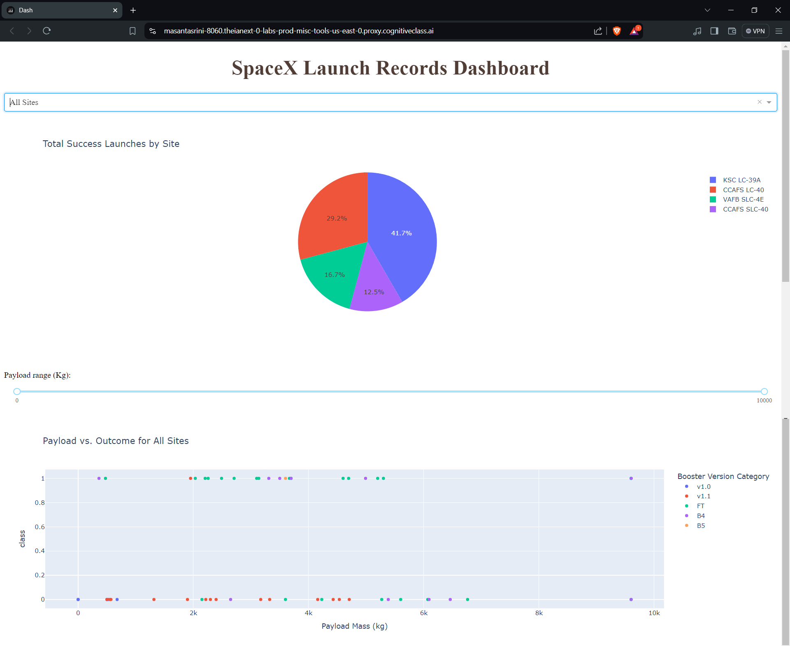

# Applied Data Science Capstone

This repository contains all project files for the **IBM Applied Data Science Capstone**.  
It demonstrates the complete data science workflow using SpaceX launch data, including data collection, analysis, visualization, and machine learning prediction.

## Project Overview
The goal of this project is to predict the success of SpaceX Falcon 9 first stage landings.  
The project combines multiple data science techniques to extract insights and build predictive models.

## Dashboard Preview

## Files in This Repository

| File Name | Description |
|------------|-------------|
| **01-Data Collection API.ipynb** | Collects SpaceX launch data using the SpaceX API. |
| **02-Web Scraping.ipynb** | Gathers additional launch data from Wikipedia using web scraping. |
| **03-Data Wrangling.ipynb** | Cleans and prepares the collected data for analysis. |
| **04-EDA using SQL.ipynb** | Performs exploratory data analysis using SQL queries. |
| **05-Data Visualization.ipynb** | Visualizes insights using Matplotlib and Seaborn. |
| **06-Launch_Site_Location.ipynb** | Analyzes launch sites and plots geographical maps. |
| **07-ML_Prediction.ipynb** | Builds machine learning models to predict launch success. |
| **spacex_dash_app.py** | Interactive dashboard built using Plotly Dash. |
| **spacex_dash.png** | Screenshot image of the interactive SpaceX dashboard. |
| **my_data1.db** | SQLite database file containing the processed data. |
| **DS-Capstone-Coursera.pdf** | Final project report in PDF format. |
| **README.md** | Project overview and file guide. |

## Tools and Technologies
- Python  
- Pandas, NumPy, Matplotlib, Seaborn  
- Scikit-learn  
- SQL and SQLite  
- Plotly Dash  
- Web Scraping (BeautifulSoup)  
- SpaceX REST API  

## Key Outcomes
- Built a data pipeline from API and web sources.  
- Created interactive visualizations for SpaceX launches.  
- Developed predictive models to estimate launch success probability.  

## Author
**Ali Hamza**  
IBM Data Science Professional Certificate
